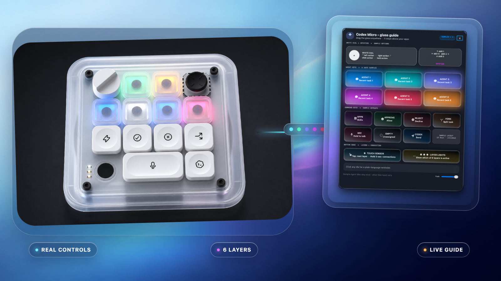
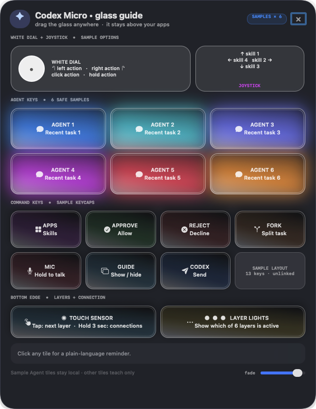

<h1 align="center">Codex Micro Glass Guide</h1>

<p align="center">
  <strong>Your tiny glass guide for learning every key, dial, light, and layer.</strong><br>
  A movable, resizable macOS guide for the Work Louder × OpenAI Codex Micro.
</p>

<p align="center"><em>Think of it as training wheels—made of glass, with excellent lighting.</em></p>

<p align="center">
  
</p>

<p align="center"><sub>Real control layout · six programmable layers · actual working guide</sub></p>

> [!NOTE]
> The device image is an original community rendering based on the official control layout, not an official product photograph. The interface is captured from the real working build with privacy-safe sample tasks.

## Watch the three-minute guide

<p align="center">
  <a href="https://github.com/grAIcetech/codex-micro-glass-guide/releases/download/v1.0.0/Codex-Micro-Glass-Guide.mp4">
    
  </a>
</p>

<p align="center">
  <a href="https://github.com/grAIcetech/codex-micro-glass-guide/releases/download/v1.0.0/Codex-Micro-Glass-Guide.mp4"><strong>Download the final three-minute video</strong></a>
  ·
  <a href="https://github.com/grAIcetech/codex-micro-glass-guide/releases/download/v1.0.0/Codex-Micro-Glass-Guide.srt">Download captions</a>
</p>

## The problem

The Codex Micro is cute, and the demo videos show all kinds of clever ways to use it. It arrived as [OpenAI's first limited-release, functional physical Codex product](https://openai.com/supply/co-lab/work-louder/), created with Work Louder. I wanted this rare first-generation tool to become genuinely useful, not an expensive paperweight.

But seeing the possibilities is not the same as remembering what every button does, especially across six layers.

I am a visual learner. My brain does not retain a layered button map just because I watched it once. I needed the controls, colors, and explanations to stay visible while I worked, so I built **Codex Micro Glass Guide**.

## What is it?

**Codex Micro Glass Guide** turns your current Codex Micro layout into a friendly floating cheat sheet. Keep it above your apps while you learn the device, click any control for a plain-language reminder, and tuck it away when muscle memory takes over.

- **✨ Looks delightful** — translucent glass, 3-D beveled buttons, and soft RGB halos.
- **🧭 Teaches as you go** — explains the dial, joystick, touch sensor, layer lights, and keys.
- **🎨 Becomes your guide** — personalize the labels, layer names, colors, shortcuts, and safe local task tiles.
- **🔒 Stays local** — the generated Mac app launches offline and keeps personal task links out of this repository.

## The fun bits

- Floats above your other Mac apps
- Moves anywhere and resizes from every edge or corner
- Shows all six programmable layers in plain language
- Gives the six Agent keys colorful backlit glows
- Can label your own key selections and recent Codex tasks
- Uses clickable teaching tiles instead of triggering consequential actions
- Works offline as a guide; live Codex destinations may still need Codex connectivity

## One-button access

Press **Control–Option–Command–G** to show or hide the guide while its lightweight helper is running. To make the physical Micro open it, map the former empty/unassigned key to that shortcut in Work Louder Input. The template labels the key **GUIDE · Show / hide** so the on-screen map matches the device.

The shortcut route provides one-button access while keeping the guide's behavior visible and easy to change in Work Louder Input.

## Make it yours

The public template is a starting point, not a prescribed layout. Give your layers memorable names, match the key labels to the shortcuts you actually use, adjust the colors, and rewrite the teaching notes in your own language. Your guide should feel like **your** desk companion.

Share your privacy-safe themes, label ideas, and accessibility improvements with the community. Keep real Codex task titles and links in your local generated app only.

## Skill + app: two pieces, one helper

The **skill** teaches Codex how to recover your layout, protect private task data, build the guide, and verify the real rendered window.

The **generated app** is the native macOS overlay you can open, move, resize, and use offline while learning the device.

<details>
<summary><strong>See the complete privacy-safe guide</strong></summary>
<p align="center">
  
</p>
</details>

## Install the skill

In Codex, run:

```text
$skill-installer install https://github.com/grAIcetech/codex-micro-glass-guide/tree/main/skills/build-codex-micro-guide
```

Then ask:

```text
Use $build-codex-micro-guide to build a floating guide for my Codex Micro layout.
```

Or copy [`skills/build-codex-micro-guide`](skills/build-codex-micro-guide) into your local Codex skills directory.

## Requirements

- macOS 13 or newer
- Swift compiler from Xcode Command Line Tools
- Codex desktop for personalized task links and mappings
- macOS 26 for native Liquid Glass; older supported versions use an AppKit visual-effect fallback

## Privacy first

Generated personal apps may contain local Codex task IDs and titles. Never commit or publish a personalized build. This repository contains only a generic template with empty, unlinked sample tasks.

## Project name

- Friendly name: **Codex Micro Glass Guide**
- Skill identifier: **`build-codex-micro-guide`**
- Proposed repository: **`codex-micro-glass-guide`**

## Attribution

This is an independent community project and is not affiliated with or endorsed by OpenAI or Work Louder. Codex, OpenAI, Work Louder, and Codex Micro are names or marks of their respective owners.

- [OpenAI × Work Louder Codex Micro](https://openai.com/supply/co-lab/work-louder/)
- [Work Louder Codex Micro setup](https://worklouder.cc/openai-micro-setup)
- [OpenAI Codex on GitHub](https://github.com/openai/codex)

## License

Released under the [MIT License](LICENSE). Personalize it, improve it, and share privacy-safe adaptations with the community.
